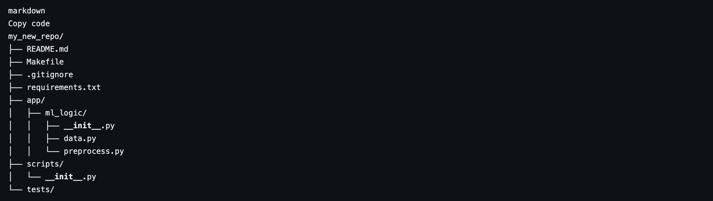

# Data Science Repository Creator

This bash script will create a new private repository on your GitHub account with the provided name and initialize it with the following structure:




## Prerequisites

Before you use this script, make sure you have the following prerequisites installed on your system:

- [Git](https://git-scm.com/)
- [Curl](https://curl.se/)

You can install these dependencies by following the links provided.

## Usage

1. Clone this repository or download the `data_science_repo.sh` script.

2. Make sure you have set up the following environment variables in your `.zshrc` (or `.bashrc`)file with your GitHub username and Personal Access Token :

    ```bash
    export GITHUB_USERNAME="your_github_username"
    export GITHUB_TOKEN="your_github_token"

4. Make the script executable by running the following command in your terminal:

   ```bash
   chmod +x data_science_repo.sh

5. Run the script with your desired repository name as an argument :

   ```bash
    ./data_science_repo.sh my_new_repo
